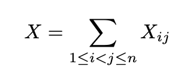
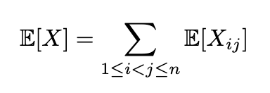
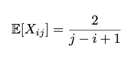
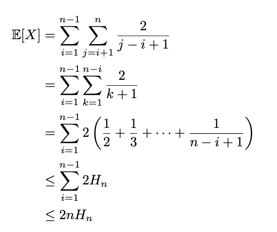
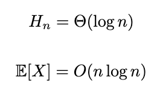
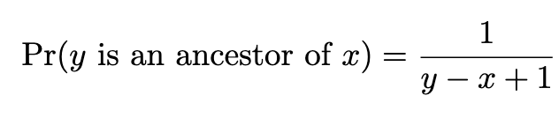
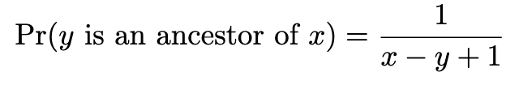
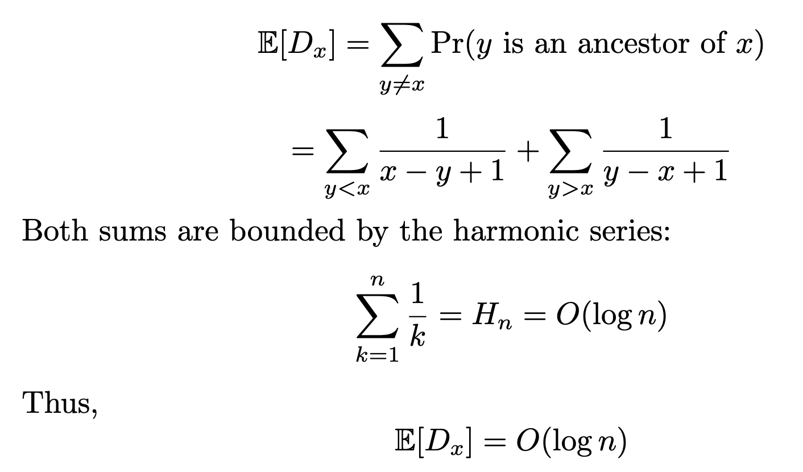

# Task 1
### Prove that the expected number of comparisons in Randomised Quicksort is O(n log n) using indicator random variables and linearity of expectation.
---
Number of elements in array = n
Number of comparisons performed = X
For each pair 1 <= i < j <= n, X<sub>ij</sub> is 1 if elements i and j are compared and is 0 otherwise.
</br>
Taking expectation and using linearity:

Since there are j − i + 1 elements, the probability of one of them being chosen as pivot and both of them being compared is 2/(j-i+1).


Finally:

# Task 2
### Show that no deterministic comparison-based sorting algorithm can avoid O(n²) worst-case behaviour when an adversary sees the pivot-selection strategy.
---
In any deterministic quicksort algorithm, the choice of pivot at any step depends on:
- the positions of elements
- outcomes of previous comparisons

`This makes the pivot position predictable for the adversary.`

The adversary can modify the input such that the pivot chosen is either the smallest or the largest element in the subarray. 

If the pivot is the smallest or largest element, one side of the partition has no elements while the other side has n-1 elements, making the recursion:

`T(n)=T(n−1)+(n−1)`
`= (n−1)+(n−2)+...+1`
`= n(n-1)/2`
`= Θ(n<sup>2</sup>)`

The worst-case time becomes `Θ(n<sup>2</sup>)`.

# Task 3
### Define a Treap. Prove that a Treap built by inserting n keys with random priorities has expected height O(log n).
---
#### Definition
*A treap is a randomized binary search tree that combines the properties of a binary search tree and a heap.*

Each node stores:
- a key (for BST property)
- a priority (for heap property)

The binary search tree properties are satisfied on keys and the heap properties are satisfied on priorities.

#### Expected height of treap is O(logn)
Assume the keys are distinct and labeled in sorted order as 1, 2,..., n.

Take node x. D~x~ denotes its depth.
For any other node y!=x, y is an ancestor of x if and only if y has the minimum priority among all nodes in the interval between x and y.
Since priorities are random, each node is equally likely to have the minimum priority.

When y>x:

When x>y:

Finding Expectation:


The height of the Treap is the maximum depth of any node. Since each node has expected depth O(log n), the expected height is `O(log n)`

# Task 4
### Implement Treap insert, delete, and search operations. Derive the
expected time complexity of each.
---
#### Algorithm for Treap insert
```text
insert(root, new node):

    if root is null:
        return new node

    current = root
    parent = null

    # step 1: find insertion position (bst rule)
    while current is not null:

        parent = current

        if new node.key is less than current.key:
            move to left child
        else:
            move to right child

    attach new node to parent as left or right child

    # step 2: fix heap property using rotations upward

    while parent is not null:

        if left child exists and its priority > parent.priority:
            perform right rotation at parent

        else if right child exists and its priority > parent.priority:
            perform left rotation at parent

        move upward to next parent

    return root
```
#### Algorithm for Treap search (same as BST search)
```text
search(root, key):

    current = root

    while current is not null:

        if key equals current.key:
            return current

        else if key is less than current.key:
            move to left child

        else:
            move to right child

    return not found
```
#### Algorithm for Treap delete
```text
delete(root, key):

    current = root
    parent = null

    # step 1: find node
    while current is not null and current.key is not key:

        parent = current

        if key is less than current.key:
            move to left child
        else:
            move to right child

    if current is null:
        return root   # not found

    # step 2: rotate node down until it becomes leaf

    while current has two children:

        if left child priority > right child priority:
            perform right rotation at current

        else:
            perform left rotation at current

    # step 3: remove node

    replace current with its only child (or null)

    return root
```
| Operation | Average case | Worst case |
|----------|--------------|------------|
| Search   | O(log n)     | O(n)       |
| Insert   | O(log n)     | O(n)       |
| Delete   | O(log n)     | O(n)       |

# Task 5
### Compare Treaps with AVL trees and Red-Black trees: when does the constant-factor simplicity of Treaps outweigh the guaranteed O(log n) height of balanced BSTs?
---
Treaps, AVL trees, and Red-Black trees all support O(logn) search, insertion, and deletion, but they differ in how they achieve balance.
- AVL trees maintain strict height balance (difference <= 1) and perform rotations whenever an imbalance occurs.
- Red-Black trees use node colors along with rotations and recoloring to maintain balance.
- Treaps assign random priorities to nodes and maintain a heap property. This randomness ensures the tree remains balanced.

#### The constant-factor simplicity of Treaps outweighs the O(logn) height of balanced BSTs in the following situations:
- **When implementation simplicity is important:** Treaps are easier to code (no height tracking or complex case analysis), reducing bugs and development time.
- **When inputs are random or non-adversarial:** O(logn) height is sufficient, and worst-case scenarios are unlikely.
- **When average-case performance is acceptable:** Applications that do not require strict worst-case guarantees can benefit from simpler and faster implementations.
